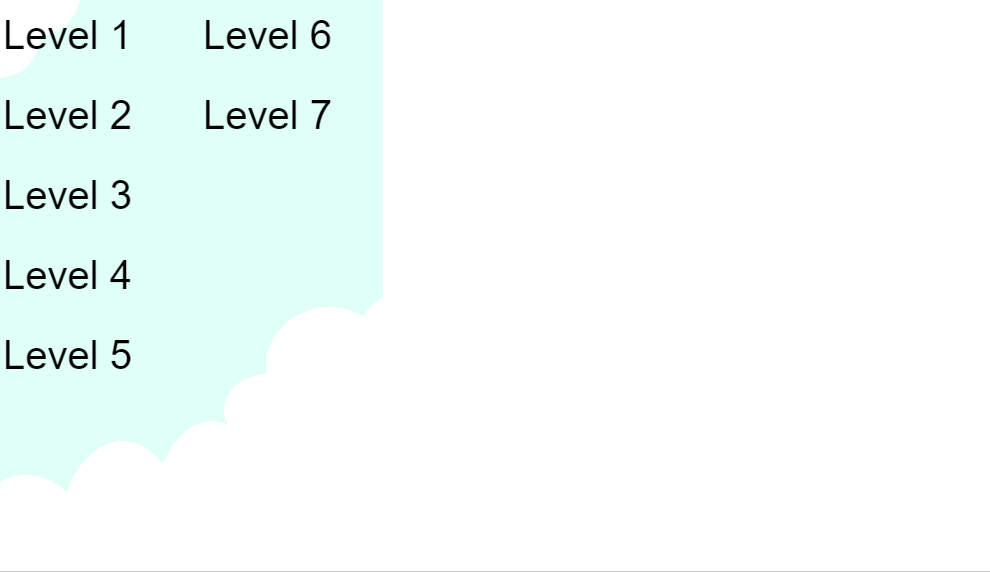

# Bouncing-Ball-Game-BBG-
My First Game using p5.js framework for Java Script. It is a 2D platform game that is controlled with only **one button!** I created this game to test my abilities to implement unique mechanics with this restriction in mind. I also hope that the "one button" control scheme would allow for inexperienced or disabled gamers to more easily enjoy playing.

### To play:
Click on the link: https://jordancle.github.io/BallGame

### Controls:
Press **SPACE** or **click on screen** to jump! 
Press **ENTER** to go to the Menu! You can click on a level in the Menu to play it! 
Press **SHIFT** to reset the level! 

### Rules:
Land on the Green block to Win! 
You can only jump once and can only jump again once you hit a block. 
There are a variety of different colored blocks in this game, play to find out what they do!

### Credits:
Game created by Jordan Le 
Background Image 6 by Angela Le 

#### Music:
Speedy Comet - Super Mario Galaxy

#### Sound Effects
Mario Brothers
Megaman X
Super Mario Bros.
Super Mario Bros. 3
Super Mario World
Super Mario All Stars
Super Metroid
